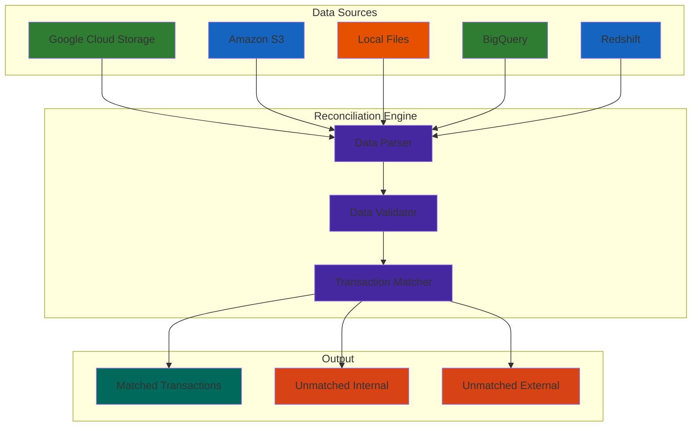
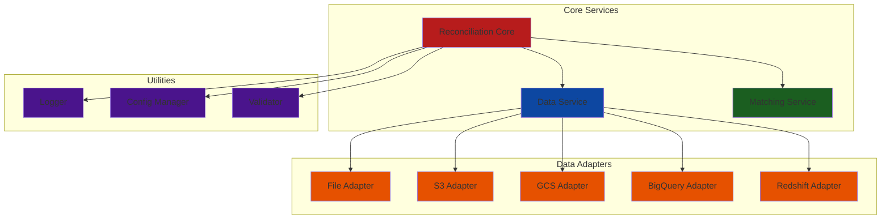

# Reconciliation Engine

A powerful and flexible data reconciliation tool that supports multiple data sources including files (CSV, PSV) and databases (BigQuery, Redshift). The engine helps you match and reconcile transactions between different sources, with support for amount and date tolerances.

## Features

- **Multiple Data Source Support**:
  - Files:
    - CSV files (comma-separated)
    - PSV files (pipe-separated)
    - Local filesystem
    - Amazon S3 (`s3://` URLs)
    - Google Cloud Storage (`gs://` URLs)
  - Databases:
    - Google BigQuery
    - Amazon Redshift

- **Flexible Matching**:
  - Match on multiple fields
  - Amount tolerance support
  - Date tolerance support
  - Customizable matching keys

- **Output**:
  - Matched records
  - Unmatched internal records
  - Unmatched external records

## Architecture

### System Architecture


### Data Flow

```mermaid
graph LR
    subgraph "Input Processing"
        I1[Read Source 1]
        I2[Read Source 2]
        V1[Validate Schema]
        V2[Validate Schema]
    end

    subgraph "Transformation"
        N1[Normalize Data]
        N2[Normalize Data]
        K1[Generate Keys]
        K2[Generate Keys]
    end

    subgraph "Matching"
        M1[Match Records]
        T1[Apply Tolerances]
        R1[Reconcile]
    end

    I1 --> V1
    I2 --> V2
    V1 --> N1
    V2 --> N2
    N1 --> K1
    N2 --> K2
    K1 --> M1
    K2 --> M1
    M1 --> T1
    T1 --> R1

    style I1 fill:#01579B
    style I2 fill:#01579B
    style V1 fill:#1B5E20
    style V2 fill:#1B5E20
    style N1 fill:#E65100
    style N2 fill:#E65100
    style K1 fill:#4A148C
    style K2 fill:#4A148C
    style M1 fill:#880E4F
    style T1 fill:#880E4F
    style R1 fill:#004D40
```


### Component Architecture


## Basic Usage

### Installation

```bash
# Clone the repository
git clone https://github.com/yourusername/reconciliation-engine.git
cd reconciliation-engine

# Install dependencies
pip install -r requirements.txt

# Set up cloud credentials (if needed)
# For AWS S3/Redshift:
export AWS_ACCESS_KEY_ID=your_access_key
export AWS_SECRET_ACCESS_KEY=your_secret_key

# For GCP (BigQuery/GCS):
export GOOGLE_APPLICATION_CREDENTIALS=/path/to/service-account-key.json
```

### Running the Engine

The reconciliation engine is configured using YAML files. Run it using:

```bash
python main.py --config path/to/your/config.yaml
```

## Configuration Examples

### File-based Configuration Example

```yaml
sources:
  internal:
    type: "file"
    path: "data/internal_transactions.csv"  # Local file
    # or "s3://bucket/internal.csv"        # S3 file
    # or "gs://bucket/internal.psv"        # GCS file (pipe-separated)
  
  external:
    type: "file"
    path: "data/external_transactions.csv"

matching:
  match_on: ["date", "customer_id", "location_id"]
  internal_key: "amount"
  external_key: "net_amount"

tolerances:
  amount: 0.01  # Allow $0.01 difference in amounts
  days: 1       # Allow 1 day difference in dates

output:
  path: "reconciliation_results"
  reconciled_file: "matched.csv"
  unmatched_internal_file: "unmatched_internal.csv"
  unmatched_external_file: "unmatched_external.csv"
```

### Database Configuration Example

```yaml
sources:
  internal:
    type: "bigquery"
    query: |
      SELECT
        date,
        customer_id,
        location_id,
        amount
      FROM `project.dataset.internal_transactions`
      WHERE date >= '2024-01-01'
    connection:
      project_id: "your-gcp-project-id"

  external:
    type: "redshift"
    query: |
      SELECT
        date,
        customer_id,
        location_id,
        net_amount
      FROM external_transactions
      WHERE date >= '2024-01-01'
    connection:
      host: "your-redshift-cluster.region.redshift.amazonaws.com"
      database: "your_database"
      user: "your_user"
      password: "your_password"
      port: 5439        # optional, defaults to 5439
      schema: "public"  # optional, defaults to public

matching:
  match_on: ["date", "customer_id", "location_id"]
  internal_key: "amount"
  external_key: "net_amount"

tolerances:
  amount: 0.01
  days: 1

output:
  path: "reconciliation_results"
  reconciled_file: "matched.csv"
  unmatched_internal_file: "unmatched_internal.csv"
  unmatched_external_file: "unmatched_external.csv"
```

### Mixed Source Configuration Example

You can mix different source types:

```yaml
sources:
  internal:
    type: "file"
    path: "s3://my-bucket/internal/transactions.csv"
  
  external:
    type: "bigquery"
    query: "SELECT * FROM external_transactions"
    connection:
      project_id: "your-gcp-project-id"
```

## Advanced Usage: Production Pipeline

For production environments, we provide an automated pipeline example using Airflow and dbt. This setup includes:

### Features
- Automated data ingestion from GCS to BigQuery
- dbt transformations for data cleaning
- Partitioned output tables
- Automated testing and validation

### Project Structure
```
reconciliation-engine/
├── airflow/
│   └── dags/
│       └── reconciliation_pipeline.py
├── dbt/
│   ├── models/
│   │   ├── staging/
│   │   │   ├── stg_stripe_transactions.sql
│   │   │   └── stg_bank_transactions.sql
│   │   └── marts/
│   │       └── fct_reconciled_transactions.sql
│   ├── dbt_project.yml
│   └── schema.yml
└── scripts/
    ├── generate_test_data.py
    └── local_pipeline.py
```

### Pipeline Setup

1. **Configure Environment**
   ```bash
   # Copy example environment file and edit with your settings
   cp .env.example .env

   # Required environment variables:
   # - GOOGLE_CLOUD_PROJECT
   # - GOOGLE_APPLICATION_CREDENTIALS
   # - AIRFLOW_HOME
   ```

2. **Initialize dbt**
   ```bash
   # Verify connection
   dbt debug
   
   # Run models
   dbt run
   
   # Run tests
   dbt test
   ```

3. **Set up Airflow**
   ```bash
   # Initialize Airflow database
   airflow db init

   # Create admin user
   airflow users create \
       --username admin \
       --firstname YourName \
       --lastname YourLastName \
       --role Admin \
       --email your@email.com

   # Start services
   airflow webserver --port 8080  # In one terminal
   airflow scheduler              # In another terminal
   ```

### Example Pipeline Output
```
Reconciliation Summary:
match_status      count  percentage
MATCHED            850      85.00
AMOUNT_VARIANCE     50       5.00
UNMATCHED_STRIPE    50       5.00
UNMATCHED_BANK      50       5.00
```

## Configuration Details

### Source Types

1. **File Sources** (`type: "file"`):
   - Required fields:
     - `path`: File location (local, S3, or GCS URL)
   - Supported formats:
     - `.csv`: Comma-separated files
     - `.psv`: Pipe-separated files

2. **BigQuery Sources** (`type: "bigquery"`):
   - Required fields:
     - `query`: SQL query to fetch data
     - `connection.project_id`: GCP project ID

3. **Redshift Sources** (`type: "redshift"`):
   - Required fields:
     - `query`: SQL query to fetch data
     - `connection.host`: Redshift host
     - `connection.database`: Database name
     - `connection.user`: Username
     - `connection.password`: Password
   - Optional fields:
     - `connection.port`: Port number (default: 5439)
     - `connection.schema`: Schema name (default: public)

### Matching Configuration

- `match_on`: List of fields to match records on
- `internal_key`: Amount field name in internal source
- `external_key`: Amount field name in external source

### Tolerances

- `amount`: Maximum allowed difference between amounts
- `days`: Maximum allowed difference between dates (in days)

### Output Configuration

- `path`: Directory to write output files
- `reconciled_file`: Filename for matched records
- `unmatched_internal_file`: Filename for unmatched internal records
- `unmatched_external_file`: Filename for unmatched external records

## Required Data Fields

Your data sources must include these fields (column names can be configured):
- `date`: Transaction date
- Amount field (configurable name)
- Any additional fields specified in `match_on`

## Development

```bash
# Run tests
python3 -m pytest tests/

# Run specific test file
python3 -m pytest tests/test_recon_engine.py
```

## Error Handling

The engine provides detailed logging for:
- File access issues
- Database connection problems
- Authentication errors
- Data format issues
- Matching process details

Logs include timestamps and error details for troubleshooting.
